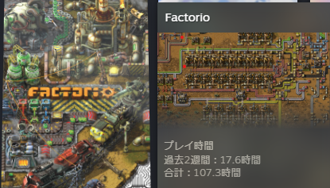

<!--more-->

買いました、と書いてますが買ったのは12月上旬なのでもう3ヶ月くらい前ｗ  
既に買ってから100時間以上遊んでしまっている😇

ここまでの経緯↓

- 初回プレーはバニラで(MOD入れずに)デフォルト設定でロケット打ち上げまで (44時間くらい)
- speed run の記事・動画を参考にしてなるはやでロケット打ち上げてみる (8時間くらい)
- バニラのまま、シナリオ `鉄道の世界` を遊んでみる ←ｲﾏｺｺ

## 初回プレー

初プレーなのでまぁ普通にやるか、ということで特に何も考えずにフリープレイで遊んでみました。 ウーン、この手のゲームはだいぶツボっぽくて、普通に睡眠時間を削って遊んでしまった…

死なないように頑張ってたんですが、機関車に轢かれて初死亡しました😇

## speed run

[Factorioの歩き方](https://zenn.dev/thr/articles/674cfb8f4b9370) という記事を見かけて、面白そうだなと思い、この記事で紹介されている [ドキュメント](https://docs.google.com/presentation/d/1XgyTdHzQM1cQrv1YpZJuRGtMv6AE9j4h6Phdn4Fe8-c/edit?usp=sharing) と [YouTubeの動画](https://www.youtube.com/watch?list=TLGGaL4rr9mEPOYyMzAyMjAyMg&v=ExLrmK1c7tA) を見ながらやってみました。  初回プレーは特に何も下調べせずに行き当たりばったりで作っていたので、効率的な作り方を知って「なるほどな～」と思いながら動画を見てました。 このおかげで、だいぶFactorioうまくなった気がする(？)

ところで、このドキュメントはいつ見ても数人は開いてるぽいので、この界隈ではメジャーなんだろか？

## 鉄道の世界

speed run も一通りやったので、知見を得た上で改めてやってみることに。 普通にやってもな、と思ったので、鉄道の世界でやってみました。この設定だとバイターが勝手に移動して巣を作ったりしないので、わりと気楽にできたかなｗ

ロケット打ち上げまでも初回プレーよりはかからず。35間くらいだったかな。ロケット打ち上げが目標じゃなかったので、衛星作ったりとかなんだりとかしてたので、やろうと思えばもう5時間くらいは短縮出来てた気がする。

で、ロケット打ち上げ終わったので、今は初回プレーではスキップしてた原子力に手を出したりし始めてます。そこまで電力逼迫はしてないけど、原発つくりたい(？)

とはいえもうそろそろ無限研究くらいしかやれることなくなってきたので、次はMOD入れてやってみてもいいかな～、しかし時間が無限に溶ける溶ける…