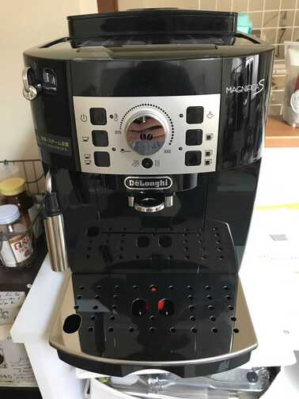

お仕事が基本的にリモートワークになったので、自宅でのコーヒー消費量が増えていました。  
で、そのうち豆から挽いて淹れれるコーヒーメーカーが欲しいな〜と思ってたんですが、 去年のAmazonのサイバーマンデーセールの時にセールをしていたので、 デロンギの全自動コーヒーメーカー「マグニフィカS」を奮発して買ってみました！

<!--more-->

Amazonリンク: [【エントリーモデル】デロンギ(DeLonghi) 全自動コーヒーメーカー マグニフィカS ミルク泡立て:手動 ブラック ECAM22112B](https://www.amazon.co.jp/dp/B088HJCVDX)

これでもエントリーモデルなんですが5万とかして、なかなか手が出なかったんですが、会社の同僚も使ってると聞いてつい勢いで…。

使ってみてますがとてもよいです！  
元々、休日とかに手動でミルで豆挽いてたりしてたんですが、平日は時間がないのでインスタントコーヒーで済ましてたのが、このマシンのおかげで平日でも豆から挽いたコーヒーが飲めるようになり、仕事が捗るようになりました💪
だいたい毎日使ってるので、1年も使えば十分元取れそうだな〜という感じです。

ちなみにお手入れは、2日に1回くらいタンクと受け皿部分を水洗いするのと豆のカスを捨てるくらいなのでそんなに面倒でもない感じかな。
ミルクでカフェラテも作れるそうなんですがめんどくさそうなのでまだ試していません😇

あと分かってたんですが淹れる時にそれなりに音が鳴ります、まぁこれはネスカフェのバリスタとかも同じかな。
豆の消費量は凄いことになってるので、定期的に買う豆を探していますｗ
自宅近くに珈琲屋さんがあって豆も売ってるので、そこのをしばらく買って飲んでみようかな〜