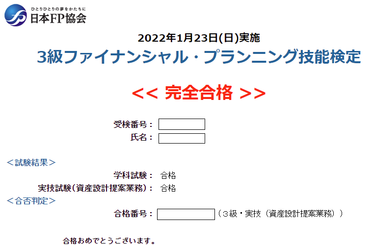
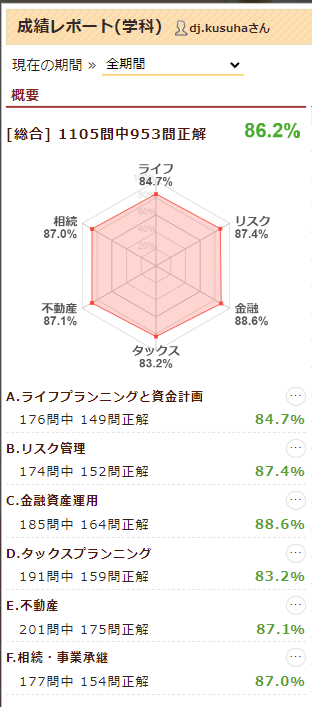
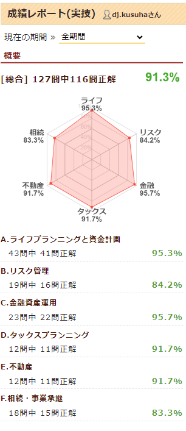

1月に受けていた3級FP技能検定、先日合格発表があって無事に合格してました！いえーい＼( 'ω')／

<!--more-->

なんでいきなりFP？って感じなんですが、ここ最近は将来のマネープランを考えたりみたいなことが多かったので、身につけた知識で受験出来る資格とかないかな？と思って調べたらFPを見つけて、オッこれだなと思って受けてみた、という流れでした。

# 勉強方法・時間について

参考書となる本を1冊買いました。自分が買ったのはこちら↓

**イメージで攻略 わかる！受かる！！ FP3級 テキスト＆問題集 2021-2022年版（マイナビ出版）**
https://www.yodobashi.com/product/100000086601415225/ [^yodobashi_ebook]

ちなみに、単にFP3級合格したい、というだけだったら特に参考書買わなくても後述の過去問サイトのみで十分だと思います。
自分は割としっかり覚えたいなーと思ったので、本屋さんでいくつか見てみて、読み進めやすそうな本書を選びました。
この本、恐らくFP3級のテキストとしては最も分厚いので、電子書籍がおすすめですｗ

この本に問題集もついてましたが、結局試験まで使いませんでしたｗ
代わりに [FP3級ドットコム](https://fp3-siken.com/) という、まんまなサイトさんがあり、そこで過去問を解いてました。
このサイト、本当によく出来ていて、「まだ解いてない問題」「過去に間違えた問題」でフィルタリングして出題したり、法律が変わって不適切となった過去問を出さないようにしたり出来るので、とても便利。
これで無料で使えるので、本当にありがたい！FP2級の時にもお世話になりますｗ

勉強時間は、なんだかんだで100時間くらいやってたかも。
正直そこまでやらなくても合格出来ると思いますｗ
自分はそのまま2級を受ける予定だったので、無駄にならんだろーという気持ちでやってました。

参考までに、FP3級ドットコムさんでの自分の学習記録をぺたり

というわけで次は5月にFP2級をがんばるぞい

[^yodobashi_ebook]: ヨドバシカメラ、電子書籍は20%還元してたりするので、こういった参考書を買うのによく使ってますｗ
ヨドバシのクレジットカード持ってると物理本も10％還元になったりするので、ありがたし。
まぁヨドバシはポイントいつ使う？という問題が常にあるんですが😇