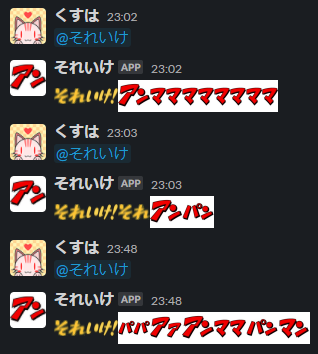

最近、趣味で [Rust](https://www.rust-lang.org/ja) を触っているんですが、その勉強の一環で Slack bot を作ってみたので、その備忘録。

<!-- more -->

# できたもの

<a href="https://github.com/dj-kusuha/soreike"></a>



## 使った物

- Rust
- Google Cloud Platform
    - [Cloud Run](https://cloud.google.com/run?hl=ja)
    - Artifact Registry
    - Cloud Build
    - Cloud Logging
    - Cloud Storage
        - 上記4つは Google Cloud CLI で `gcloud run deploy` すると使われるものたち
    - Secret Manager

# なぜこれを作ったのか

> Slackでアンパンマンがちょっと流行った話 / Zenn.dev
> https://zenn.dev/dividebyzero/articles/2815cef7cd446f

この記事を読んだのがきっかけ。ちょうど手頃な Slack bot だったので、 bot をデプロイするまでの一連の勉強には良いかなと。

あとは、このツイート記事を読んだことで「オッ AWS Lambda だけで完結して作れるじゃん」と思って機運が高まったのが着手の要因に。

<blockquote class="twitter-tweet"><p lang="ja" dir="ltr">ついに API-GW なしに Lambda だけで HTTPS なエンドポイントを生やせるように・・・！<br><br>GitHub とか Slack からの Webhook 受けとしても使いやすくなるし、良いすね🤗<br><br>/ &quot;AWS Lambda Function URLs: built-in HTTPS endpoints for your Lambda functions&quot; <a href="https://t.co/Evs4OAL2Iv">https://t.co/Evs4OAL2Iv</a> <a href="https://t.co/zaEb3Epeo2">pic.twitter.com/zaEb3Epeo2</a></p>&mdash; Tori Hara (@toricls) <a href="https://twitter.com/toricls/status/1511842011933863936?ref_src=twsrc%5Etfw">April 6, 2022</a></blockquote> <script async src="https://platform.twitter.com/widgets.js" charset="utf-8"></script>

(何故AWSではなくGCPで実装することになったのかは後述)

# やったこと

## 1. Slack で bot アプリケーションを新規作成

[Slack Appの作り方を丁寧に残す【BotとEvent APIの設定編】 - Zenn](https://zenn.dev/mokomoka/articles/6d281d27aa344e)

上記記事がかなり詳しく書いてくれていて、ほぼこれの通りに作ったので、詳細は割愛。

## 2. Rust でコーディング

### 2.1 サーバー待ち受け

[Cloud RunでRustのAPI Serverを動かす - Zenn](https://zenn.dev/kowaremonoid/articles/7e077f9eb4439b)

まず、上記記事を参考に、 Rust でサーバー待ち受けのコードを用意。ここも詳細割愛。

### 2.2 Slack URL Verification を通す

その後、Slack App でイベントを受け取るために、 [URL Verification](https://api.slack.com/apis/connections/events-api#the-events-api__subscribing-to-event-types__events-api-request-urls__request-url-configuration--verification0) を通す必要があるので、そのコードを用意。
ここも、 1. で参考にした記事を参考にしています。

やっていることはシンプルで、 1. で作った時に発行されている `Verification Token` を環境変数 `SLACK_VERIFICATION_TOKEN` に定義しておき、それと `token` との一致確認と、 `type` が `url_verification` であるかを確認して、問題が無ければ `challenge` の内容を JSON 形式で返しています。

```Rust
async fn slack(Json(payload): Json<SlackRequest>) -> impl IntoResponse {
    match env::var("SLACK_VERIFICATION_TOKEN") {
        Ok(token) => {
            if payload.token != token {
                return (StatusCode::UNAUTHORIZED, String::new());
            }
        }
        Err(message) => {
            println!("SLACK_VERIFICATION_TOKEN is not available: {}", message);
            return (StatusCode::INTERNAL_SERVER_ERROR, String::new());
        }
    }

    if let Some(r#type) = payload.r#type {
        if r#type == "url_verification" {
            match payload.challenge {
                Some(challenge) => {
                    return (
                        StatusCode::OK,
                        format!(r#"{{"challenge":"{}"}}"#, challenge),
                    )
                }
                None => return (StatusCode::BAD_REQUEST, String::new()),
            }
        }
    }

    return (StatusCode::OK, String::new());
}
```

なお、環境変数への定義は、デプロイ時には Secret Manager を利用しつつ、開発中は `.env` ファイルを作ってそこに環境変数を定義し、 [rust-dotenv](https://crates.io/crates/dotenv) crate を使って読み込んでいます。

### 2.3 メンションが飛んできたらランダム文字列を生成して Slack に投稿

Slack Event API の [app_mention](https://api.slack.com/events/app_mention) を利用し、メンションを受けたらそのチャンネルにランダム生成された文字列を投稿します。

```Rust
fn post_anpanman(channel: String) {
    // 投稿文字列を決定する
    let body = create_body();

    let token;
    match env::var("SLACK_BOT_TOKEN") {
        Ok(t) => token = t,
        Err(message) => {
            println!("SLACK_BOT_TOKEN could not be used: {}", message);
            return;
        }
    }

    let client;
    match slack::default_client() {
        Ok(c) => client = c,
        Err(message) => {
            println!("Failed to get a Slack client: {}", message);
            return;
        }
    }

    match slack::chat::post_message(
        &client,
        &token,
        &PostMessageRequest {
            channel: &channel,
            text: &body,
            ..PostMessageRequest::default()
        },
    ) {
        Ok(response) => println!("{:?}", response.message),
        Err(message) => println!("Failed to post a message to Slack: {}", message),
    }
}

fn create_body() -> String {
    // ランダムに表示させたい絵文字たち
    let dat = [
        ":sore_an:",
        ":ike:",
        ":anpanman_an:",
        ":anpanman_pan:",
        ":anpanman_man:",
        ":aa:",
        ":mama:",
        ":an_papa:",
    ];

    let mut rng = rand::thread_rng();
    let mut body = String::from(":sore_an: :ike: ");

    // 絵文字数の決定 (3～12)
    let length = rng.gen_range(3..=12);
    for _ in 0..length {
        // 絵文字の決定
        let index = rng.gen_range(0..dat.len());
        body.push_str(dat[index]);
        body.push_str(" ");
    }

    return body;
}
```

## 3. Dockerfile を用意

Cloud Run にデプロイするために、 docker image を作る必要があるため、 Dockerfile を用意。
最初は [公式のドキュメント](https://cloud.google.com/run/docs/quickstarts/build-and-deploy/deploy-service-other-languages) を見ながら作ったんですが、


- [RustのDocker Build時間短縮したい - Zenn](https://zenn.dev/ucwork/articles/acec204571362b)
- [First steps with Docker + Rust - DEV Community](https://dev.to/rogertorres/first-steps-with-docker-rust-30oi)

このあたりを参考に、処理を見直してビルド時間を短縮したり、ビルド時とデプロイ時のベースとなる image を変えて軽量化したりしています。
本当は記事にもあるような `debian:stable-slim` みたいな軽量イメージを使いたかったんですが、これを使うと実行して Slack 投稿時に

```
error trying to connect: error:1416F086:SSL routines:tls_process_server_certificate:certificate verify failed
```

と SSL 証明書周りでエラーが出てしまい、このあたり調べるのも大変そうだったので、 `rust:slim` で妥協。
誰か解決策教えてください（？）

## 4. Cloud Run にデプロイ

`gcloud run deploy` でデプロイをします。最初は何をやってるのか良くわかってなかったんですが、これを行うと

1. Cloud Storage にソースをアップロード
2. Cloud Build で docker build
3. ↑ で出来た image を Artifact Registry にアップロード
4. Cloud Run で ↑ にアップロードされた image を実行

まで行われる模様。

コマンド一つでいろいろやってくれるのは楽ちんだけど、中身を知るのは大変😅


## 5. GitHub Actions で、リポジトリに push されたら自動でデプロイされるように

4.までで機能リリースとしては完了なんですが、折角なのでもうちょっと自動化を頑張ることに。
しかしここは GCP のサービスアカウントについてしっかり理解しないといけなかったため、めちゃくちゃ時間かかりました😩

幸い、 GitHub Actions 側には Google 謹製の [auth](https://github.com/google-github-actions/auth) と [deploy-cloudrun](https://github.com/google-github-actions/deploy-cloudrun) があり、ドキュメントに従えば概ねちゃんと動いてくれました。
ドキュメントをしっかり読まずにところどころ飛ばして読んだ所為でいろんなところで躓いてしまった…。


# 以下、つまづいたことなど

## AWS の 2FA が通せなくなってた😇

半年程前にスマホを機種変更してたんですが、その時に Authenticator の切り替えに失敗し、 2FA ログインが出来なくなってましたｗ

しかも、その場合用に SMS が飛んでくる仕組みだったぽいんですが、 AWS の電話番号入力は国際番号(+81)から入力すべきだったらしく、その入力も間違えていてお問い合わせベースでの対応に…。

とりあえず動かしてみたいし、そもそも AWS も GCP もあんまり使った事が無かったので、 GCP でやってみるか、ということで GCP で作りました。

## Cloud Run の使い方が不明

本当は Cloud Functions でサクッと作りたいな～とか思ってたんですが、 Rust は対象外であった… ということで、そもそも Rust の勉強がてら、というのがあったので、 Cloud Run を使って Rust で動かす、という方針に。

しかし、 Cloud Run は使ったことが無かったので、「サーバー待ち受けのコードを書く必要がある」というところの理解までにしばらくかかりましたｗ

[Cloud RunでRustのAPI Serverを動かす - Zenn](https://zenn.dev/kowaremonoid/articles/7e077f9eb4439b) の記事を参考にして、無事に動かすことが出来ました 🎉

## Cloud Build でタイムアウトしてしまう

Rust のコンパイルがそこそこ重い処理だったので、デフォルトの Cloud Build のスペック及びタイムアウト時間(10分)だとタイムアウトしていまうようでした。
これは、 `gcloud config set builds/timeout <指定秒数>` と設定しておくか、 `CLOUDSDK_BUILDS_TIMEOUT` 環境変数を定義しておくと変更出来るので、それで対処。

なお、似たような設定値として `app/cloud_build_timeout` があるんですが、これは Google App Engine をデプロイするときのタイムアウト設定っぽい。紛らわしすぎる…これで1時間ほどハマってしまいました😩


# おわりに

Rust の勉強がてら、ということでやってみたんですが、どちらかというと GCP のお勉強になりました😅
サーバー周り、結構興味はあったんですが今まで真面目に触った事が無かったので、良いきっかけになったなーと思います。

またそのうちサーバー周りをいじる何かを作ろうと思います💪


# 参考
- [Cloud RunでRustのAPI Serverを動かす - Zenn](https://zenn.dev/kowaremonoid/articles/7e077f9eb4439b)
- [RustのDocker Build時間短縮したい - Zenn](https://zenn.dev/ucwork/articles/acec204571362b)
- [First steps with Docker + Rust - DEV Community](https://dev.to/rogertorres/first-steps-with-docker-rust-30oi)
- [クイックスタート: Cloud Run にサービスをデプロイする | Cloud Run のドキュメント | Google Cloud](https://cloud.google.com/run/docs/quickstarts/build-and-deploy/deploy-service-other-languages)
- [Move token to authorization header by silverjam · Pull Request #105 · slack-rs/slack-rs-api · GitHub](https://github.com/slack-rs/slack-rs-api/pull/105)
- [Slack Appの作り方を丁寧に残す【BotとEvent APIの設定編】 - Zenn](https://zenn.dev/mokomoka/articles/6d281d27aa344e)