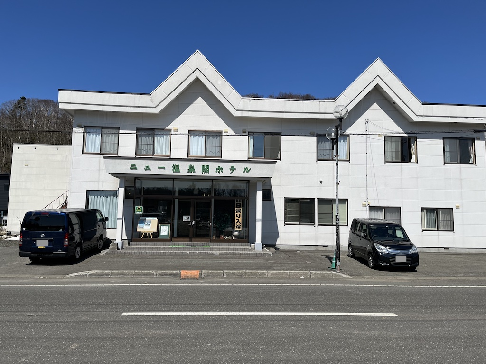
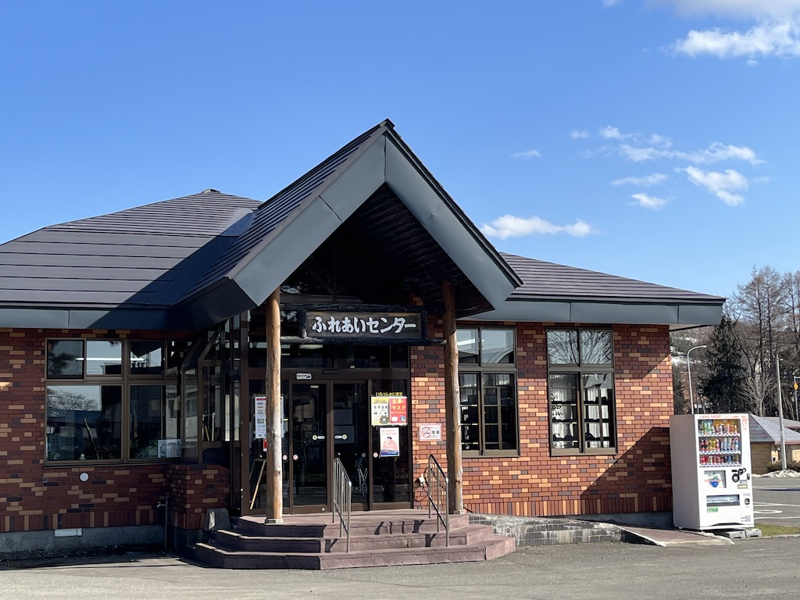
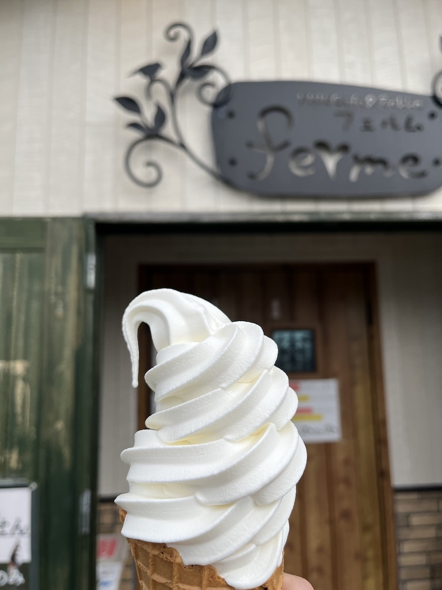
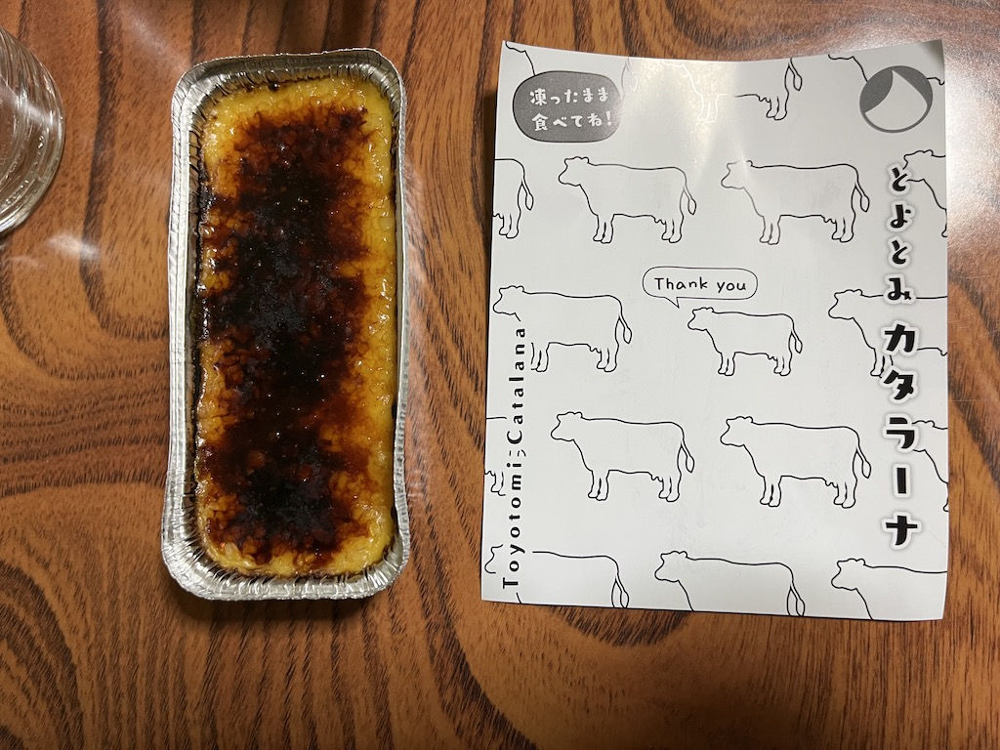
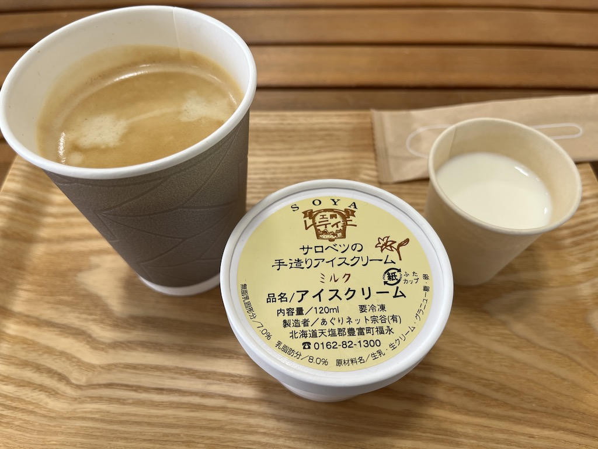
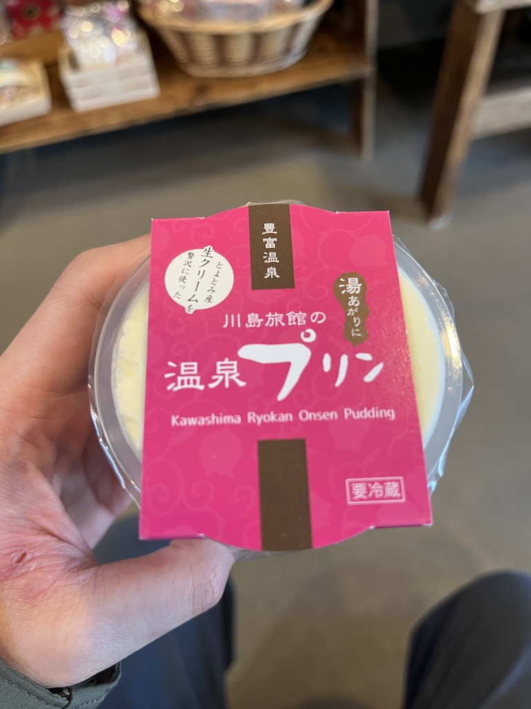
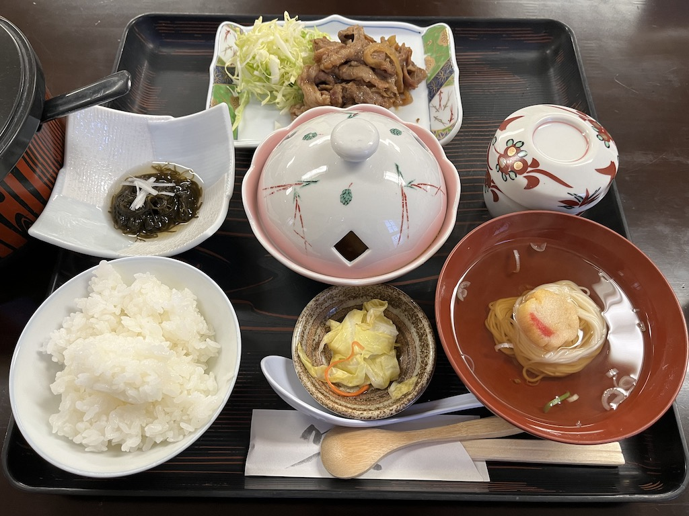
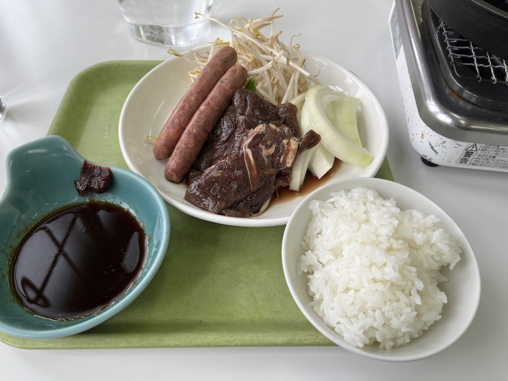
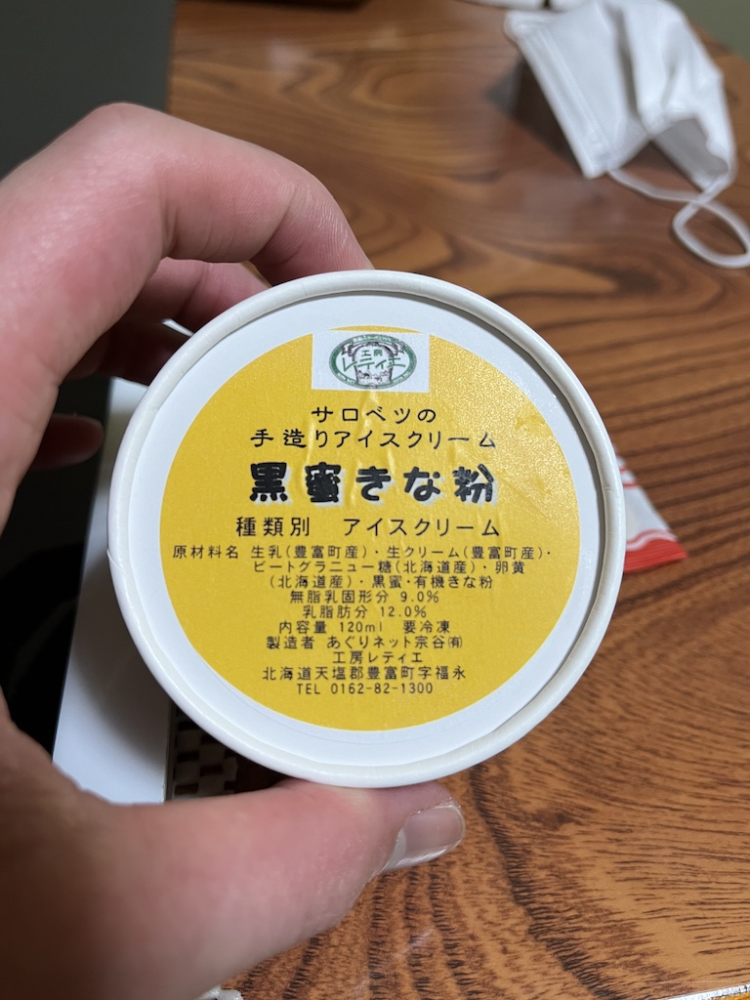

くすはさんは12歳くらいから全身アトピー性皮膚炎で、今なお皮膚科に通ってお薬をもらっています。

そんな中、数年前に「豊富温泉がアトピーに良いらしい」と知り、いつか行きたいなぁと思ってたんですが、今回思い切って3泊4日で行ってきました！

せっかくなのでブログに記録を残しておきます。

豊富温泉の湯治については、 [公式サイト](https://toyotomi-onsen.com/) があるのでこちらを見てみてください。

<!--more-->

## 交通手段

札幌から公共交通機関で行く場合はバスかJRになるかなと思うんですが、今回はJR北海道で [HOKKAIDO LOVE！６日間周遊パス](https://www.jrhokkaido.co.jp/hokkaidolove/index.html) なるものが販売されていたので、今回はJRで行く事にしました。通常はJRで往復すると自由席でも片道1万円近くするんですが、このパスだと往復指定席でも1.2万円だったので、ずいぶんお得！

ちなみにバスだと札幌から乗り換えなく行けるので、移動中ずっと動かずに寝てたい人とかは良いかも。自分はちょっと動いたりしたい（

## 宿泊先

こちらも [どうみん割](https://douminwari.jp/) が使える時期だったので、1万円以下なら良いかな〜と思って探していたところ、 [ニュー温泉閣ホテル](https://new-onsenkaku.com/) さんの湯治プランが1泊2食付き7,300円[^1]とリーズナブルで良さげだったのでこちらをチョイス。どうみん割のおかげで1泊あたり「3,000円引き + 2,000円クーポン付き」ということで実質1泊2,300円に…安すぎる。

他にもいくつか宿泊先があったので、機会があれば他も泊まってみたいところ。 [何やらダーツライブ2が置いてあるところ](https://ukasuymosir.com/floor-map/) もあるらしい…ここは気になってたけど、せっかくどうみん割使えるので2食付きのところを選んでしまった :innocent:

## 温泉

温泉は宿泊先にあったところと、[ふれあいセンター](http://www.town.toyotomi.hokkaido.jp/section/syoukoukankouka/a7cug60000001fqi.html) の2カ所に入りました。どちらも同じ泉質で、前評判通り石油臭があり、浴槽の表面にうっすら油分がキラキラしてました。ふれあいセンターの方は湯治専用のぬるめの浴槽があったので(38-39℃くらい)、30分くらい入っていてものぼせずにのんびり湯治できました。

ちなみにふれあいセンターの開店後1時間は濃い、というお話だったので、最終日に行ってみたんですが…本当に濃くてびっくり！原油がぷかぷか浮いてるのが見えましたｗ
浴槽から出て手拭いで身体を拭くと、手拭いにしっかり色がついてしまうくらい。保湿効果もしっかりありました。ただ、濃すぎて刺激が強めなので、慣れないうちはこの時間帯は控えた方が良いとのこと。

そういえば、毎日、朝晩と保湿剤を塗っているんですが、 **この湯治期間は1回も保湿剤を使いませんでした。** それでも、お肌が保湿されてる感があって、温泉効果だな〜と実感。 ~~プラシーボかもしれないけど~~

## 湯治コンシェルジュデスク

ふれあいセンターに [コンシェルジュデスク](https://toyotomi-onsen.com/consult) があり、湯治に来たらまずここ！とWebサイトにも書いてあったので、お邪魔してきました。

担当の方が凄く親切に対応してくださり、入浴方法や注意事項などを説明していただきました。健康相談員の方など3名ほどいらしたんですが、とても話しやすい雰囲気で迎えてくださり、この湯治期間で一番感動したかもしれません。対応してくださった担当の方、ありがとうございました :pray:

## 観光

豊富温泉周辺にはいろいろと観光スポットがあるらしいんですが、目的が湯治だったのであまり観光はせず…

そもそも車がないとなかなかしんどく、バスは1日4〜5本だったり、たとえば [サロベツ湿原センター](http://sarobetsu.or.jp/swc/) まではバス自体が無い(予約制のタクシーで代替されているらしい)など、観光するなら車で来ないとダメそう。

というわけで次行くときは車で乗り込もうと思いますｗ

## 総評

湯治期間中、保湿剤もステロイド剤も使わなかったですが、ちょっと良くなった状態で帰ることになりました。アトピーの方の3〜4割くらいは、最初の数日間は悪化するパターンがあるらしいので、幸運だったかも。

今回は3泊4日だったので、湯治期間としてはかなり短く、効果がちゃんと出る前に帰ることになるんですが、今回なかなか状態が良かったので、またいつか、今度は2週間くらい滞在出来るように時間を作って、再訪したいなぁと思います :smile:

## フォトギャラリー

主に食べたもの（

[^1]: Webサイトだと税別表記になっている
