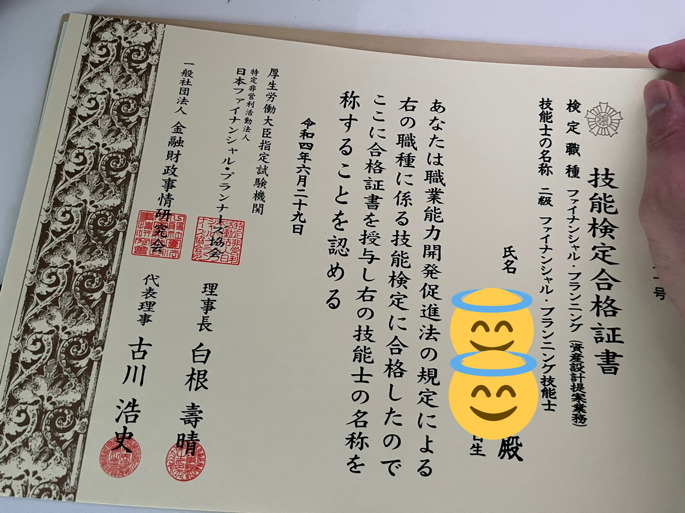
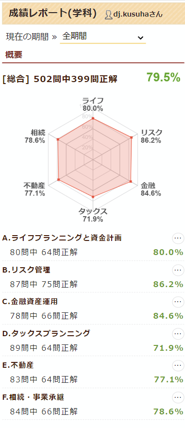
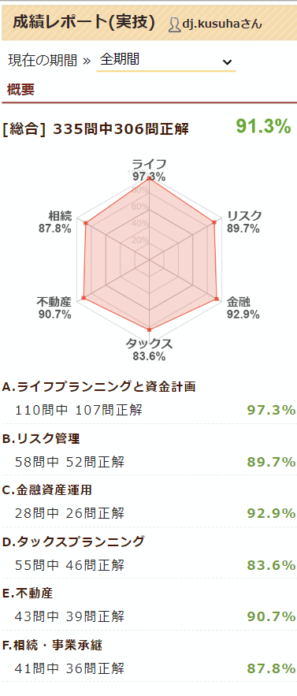

3月に [3級FPに合格した記事]() を書きましたが、その後2級も受験し、無事に合格出来ました💪

学科は 50点/60点 (36点以上で合格)、実技は 95点/100点 (60点以上で合格) ということで、 **完全合格**[^1] です＼( 'ω')／

これで **2級ファイナンシャル・プランニング技能士** を名乗ることができますｗ

今働いている業界だとなんの役にも立ちませんが😇

最初から2級までは取るつもりだったので、ひとまず目標達成💪('ω'💪)

次どうするかはちょっと考え中…
実務経験が無いので1級はそのままでは受けられない[^2]し、 AFP → CFP というコースも結構敷居が高いし

そもそも前述の通り **今働いている業界だとなんの役にも立たない** ので、モチベが続かない…

なので一旦は別の事をやろうかな～と思ってますw

ちょうど10月に [IPAのPM試験](https://www.jitec.ipa.go.jp/1_11seido/pm.html) があり、業務にも割と直結してるので、これを受ける予定。
これも結果が出たらブログで報告します📝

# 勉強方法・時間について

前回と全く同じ戦略をとりましたｗ

- 参考書を1冊買って一通り読む
  - [イメージで攻略 わかる！受かる！！ FP2級 AFP テキスト＆問題集 2021-2022年版（マイナビ出版）](https://book.mynavi.jp/ec/products/detail/id=123668)
    - 今は [2022-2023年版](https://book.mynavi.jp/ec/products/detail/id=130331) が出ています
- [FP2級ドットコム](https://fp2-siken.com/)さんで過去問を解く

これも3級の時と同じなんですが、FP2級ドットコムさんの過去問が優秀で、ちゃんと解説までついているので、参考書無くても合格ラインには達せそうな気がします。
困ったらググったら大体出てきますしね。良い時代ですわ～～～

勉強量は、正直3級の時より減ってたかも…まぁ3級と範囲は同じなので、3級の時にしっかり基礎が出来ていた分、2級の時にあんまり勉強しなくても良かったのかも。

FP2級ドットコムさん、今回も大変お世話になりました🙏

前回同様、学習履歴を貼っておきます。

[^1]: FPの合格発表サイトで、学科・実技共に合格点になっていると「完全合格」と表示され、これが面白くてTwitterでバズるなどしてましたｗ
[^2]: 受験資格として、実務経験があって必要なコースを修了するか、あるいはCFP認定される必要がある