[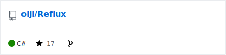](https://github.com/olji/Reflux)

最近 [beatmaniaIIDX INFINITAS](http://p.eagate.573.jp/game/eac2dx/infinitas/p/common/top.html) を再開しました！
やっぱり楽しいですね💪('ω'💪)

で、プレーしているとクリアやスコアの状況を管理したくなるわけですが、手動でやるのはめんどくさい！

というわけでどうしたものかと思案していたんですが、 [Reflux](https://github.com/olji/Reflux)[^1] というツールを教えてもらったので、導入してみました。

可視化した結果は以下の通り。

[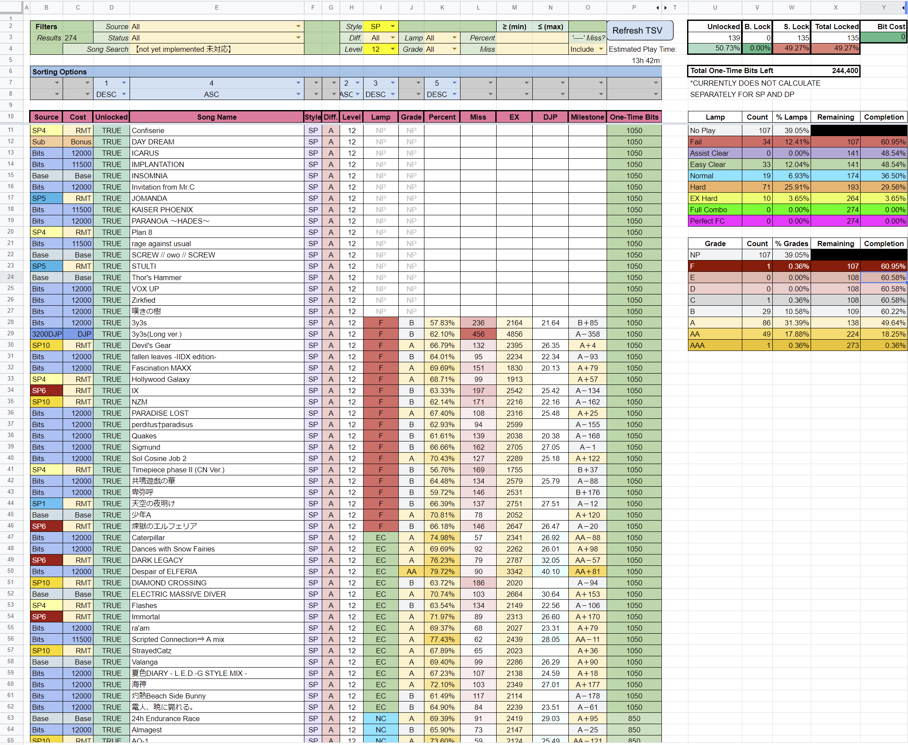](2022-09-03-00-17-39.png)

[実際の Spreadsheet はこちら。](https://docs.google.com/spreadsheets/d/1xrS5Evao-OTzqpbwOSKlvCYdTIX61IDuKj6FaIDdsy0/edit#gid=1205234399)

難易度やSP/DPでフィルタかけたり、ソート順を任意に指定できるので、自分の好きな見た目にできます！
これがあると現状把握や次の目標設定とかが凄い便利になったので、お勧めです。
公式でこういう機能があったらいいんだけどな(小声)

以下、Reflux の導入手順をまとめておきます。

当然ですが、 **以下の手順実行は自己責任でお願いします** 🙏

---

# 導入手順

## 0. 事前準備

- Google アカウントを用意
  - 可視化時に Google Spreadsheet を利用するために必要
- パソコン版 Google ドライブをインストール
  - https://www.google.com/intl/ja_jp/drive/download/ から
  - Reflux で取得したデータを自動的に同期するために必要
  - 必須ではないですが、都度手動で更新するのは面倒なので、インストールするのをお勧め
- .NET Core 3.1 の .NET デスクトップランタイムをインストール
  - https://dotnet.microsoft.com/ja-jp/download/dotnet/3.1 から
  - Reflux 1.11.1 から必要になったようです
  - INFINITASを遊ぶようなPCだと `x64` をダウンロードしておけばほぼほぼ問題無いはず
- `.7z` ファイルを解凍できる解凍ソフト
  - [CubeICE](https://www.cube-soft.jp/cubeice/) など

## 1. Reflux をダウンロード

Reflux は GitHub 上で配布されています。 [Releases](https://github.com/olji/Reflux/releases) から最新バージョン(この記事執筆辞典では `1.11.1` )をダウンロードします。
以下の画像では `Reflux.1.11.1.7z` と書かれたリンクをクリックするとダウンロードできます。

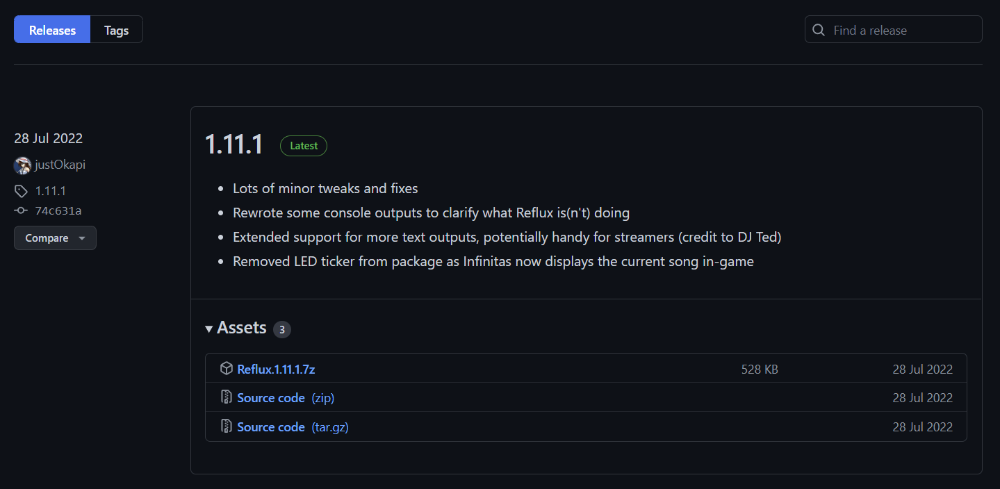

## 2. 解凍して実行

解凍すると `Reflux.exe` というファイルがあるため、実行します。

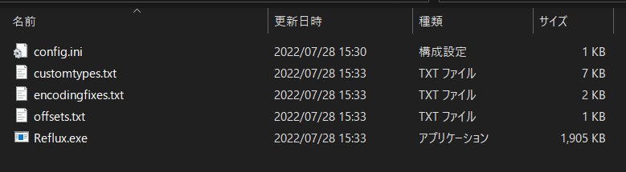

正常に起動できたら、以下のようなコンソール画面が表示されます。

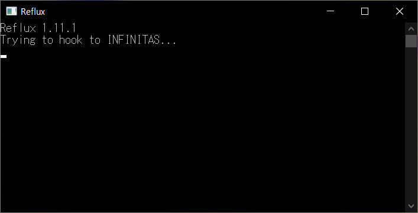

**正常に起動しない場合、 .NET Core 3.1 のデスクトップランタイムが正常にインストールされていないかもしれません。**

コンソール画面が出たら、そのまま置いておきます。

## 3. INFINITAS を起動

上記のコンソール画面を出した状態で、 INFINITAS を起動します。
Reflux が INFINITAS の起動を正常に検知できたら、コンソール画面に以下のようなログが表示されます。

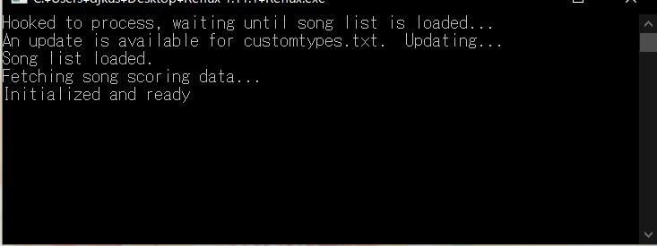

その後、普通に INFINITAS をプレーし、終了後に Reflux のフォルダを確認していると、初期状態では無かったフォルダやファイルが存在しているはずです。

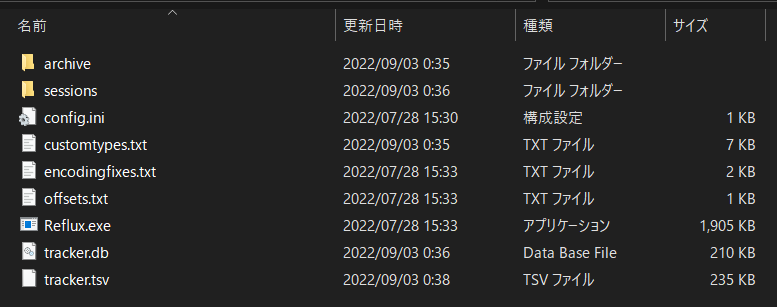

これで、 Reflux が各種プレー成績のデータを取得できました。

## 4. Okapi's Unlock Tracker Spreadsheet をコピー

さて、 Reflux 自体はこの「 INFINITAS からデータを取得してファイルに出力する」までを行います。
Reflux 単体では可視化ができないわけです。

そこで、 Reflux リポジトリの README にも記載がある、 [Okapi's Unlock Tracker Spreadsheet](https://docs.google.com/spreadsheets/d/1knAd_M_YMCYxc174y-3M_6EQNGsT2HpUKLQQjE_qhYs/edit?usp=sharing) を使って可視化したいと思います。

まず上記リンクにアクセスし、 `ファイル > コピーを作成` で自分用にコピーを作成します。

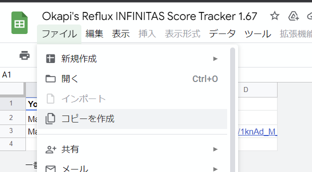

これで自分用のコピーが生まれます。[^2]

## 5. Reflux のフォルダを Google ドライブに配置

先ほどコピーしたスプレッドシートが自分の Google ドライブにあるはずですが(多分一番上の階層)、そこと同じ場所に Reflux のフォルダを移動させます。
パソコン版ドライブをインストールしておけば、 Windows のエクスプローラ上で移動できます。

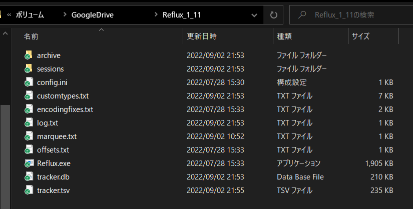

こうすることで、 Reflux で出力したプレー成績のデータが、都度自動的に Google ドライブにアップロードされます。

## 6. コピーしたシートで `Import TSV data` をクリック

コピーしたスプレッドシートの上部にある `Import TSV data` ボタンをクリックし、
次に表示される `Import from Drive` という項目をクリック。

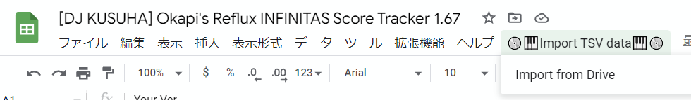

### 初回のみ、承認が必要

初回のみ、承認が必要と言われるので、内容を確認します。

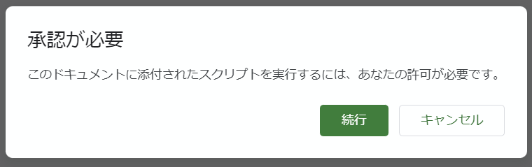

途中、 **このアプリは Google で確認されていません** というダイアログが表示されます。

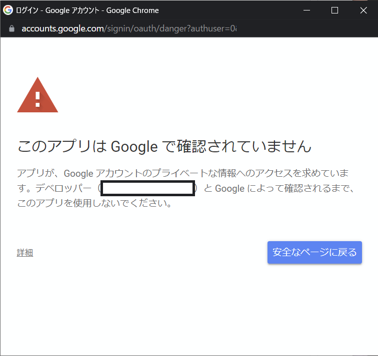

左下の「詳細」を押すと、 `Import TSV (安全ではないページ)に移動` というリンクが現れます。
続行するにはこのリンクを押す必要がありますが、ダイアログに記載の通り **リスクを理解した場合のみ** 先に進んでください。

`Import TSV が Google アカウントへのアクセスをリクエストしています` というダイアログが出るので、中身を確認し、良ければ `許可` をクリックします。

### 6'. `Import TSV data` を使わず手動でインポートする

ちなみに、 6. の手順で Import TSV data を使わず、手動でインポートする事も可能です。

1. `TSV` という名前のシートが非表示になっているので左下の `三` から選択して表示します。
2. `ファイル > インポート` から、 Reflux フォルダの `tracker.tsv` を選択します。
3. 表示されたダイアログで `インポート場所` を `現在のシートを置換する` にし、 `テキストを数値、日付、数式に変換する` のチェックを外します
4. `データをインポート` ボタンを押します。

---

これでめでたく可視化されます 🎉

1回この作業を行えば、以降は 6. の `Import TSV data` ボタンを押す(または 6'. の作業をやる)だけになります。簡単ですね！

みなさんも Reflux を使って INFINITAS ライフをenjoyしましょう 👍

[^1]: IIDX には [Reflux という曲がありますよね](https://p.eagate.573.jp/game/2dx/22/p/newsong/reflux.html)。ここから取ったのかな？
[^2]: 初期状態では自分しかアクセスできないようになっているので、他の人に見せたい場合は共有設定を変更してください。
