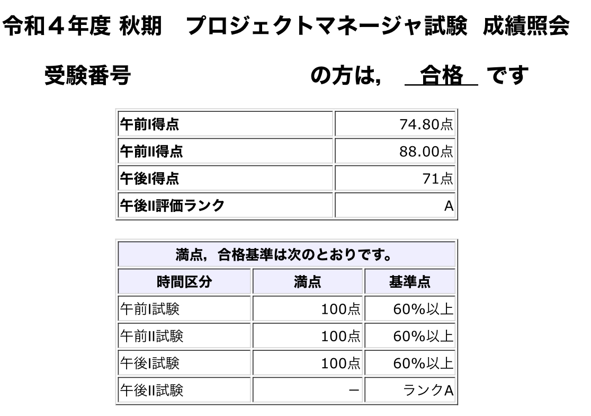
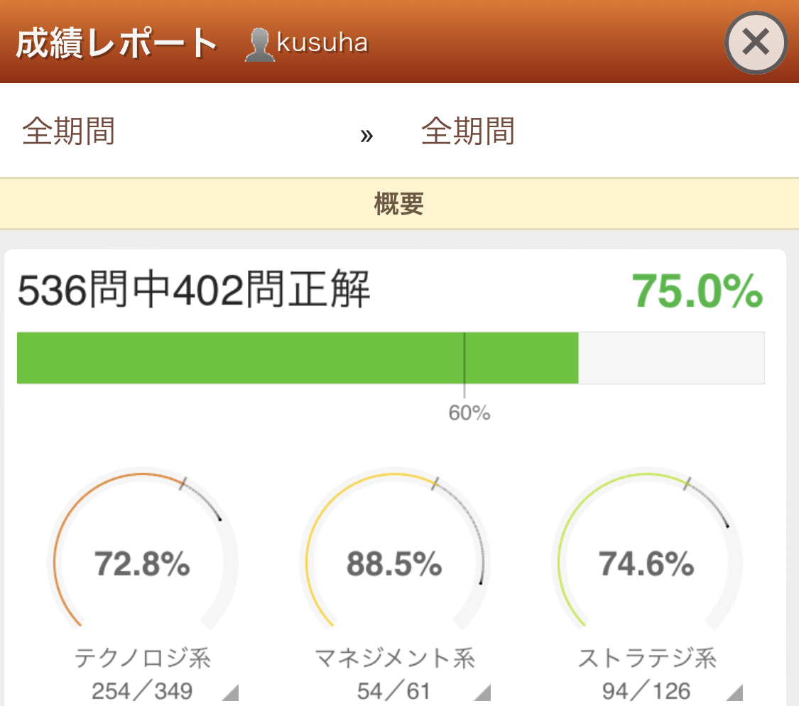
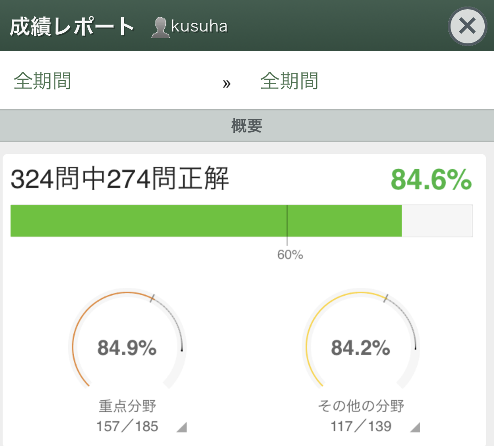

2022年10月9日に実施された、IPAの令和4年度秋期プロジェクトマネージャ(PM)試験を受験し、本日合格発表だったんですが、**見事合格してました！**  
めっちゃ嬉しい～。

参考までに私の状況と勉強方法を記しておこうと思うので、これから受験しようと考えている方の参考になれば幸いです🙏

## お仕事の状況など

社会人12年目。社会人1年目からプログラマとしてソフトウェア開発に関わっています。  
エンジニアをやりつつプロジェクトマネジメント的な事は時々やってましたが、ちゃんとマネジメントをメインに働き始めたのは3年くらい前からです。

現在は少人数のチームのマネージャをやりながら、社内に設置された PMO (Project Management Office) のメンバーとして全社横断的な課題解決をしたりしています。

## 試験受験のきっかけ

元々興味はあったんですが、調べると午後の問題が記述、特に午後IIが論述ということで、「これはしんどそうだなぁ～」と思って敬遠してましたｗ  
だって2時間で何千文字も文章書くの、しんどいじゃないですか…。

が、今年に入って今の上司の方から  
「そんなに大変じゃないよ、くすはさんならちゃんと勉強したら合格するんじゃない？」  
と言われたので、 ま～受かったら自分に箔も付くしネ、ということで  
「じゃあやるか～」  
と思って受験を決意(？)。

## 勉強のために購入したもの

### 2022　プロジェクトマネージャ　「専門知識＋午後問題」の重点対策 

https://www.amazon.co.jp/dp/B0B1J8ZZ9L

午前II, 午後I, 午後II 対策として購入。  
「みよちゃん本」と呼ばれる三好 康之氏の参考書と迷ったんですが、昔IPAの試験を受けたとき[^1]にひたすらお世話になっていたiTEC社のものを信用して購入しました。

PMBOKなどを体系的に勉強したことが無かったので、知識一般を学びつつ、午後Iの過去問解説が充実してたのと、午後IIの回答例論文が5～6本ほど載っていて参考になりました。

### 2022　高度午前Ⅰ・応用情報午前試験対策書

https://www.amazon.co.jp/dp/B09J8VZ6NN

午前I 対策として購入。

…が、あまり活用しませんでした😅  
午前対策は過去問道場で事足りちゃいました(後述)

## 勉強方法

### 午前I

午前I については、 [応用情報技術者試験ドットコム](https://www.ap-siken.com/) の過去問道場というコンテンツでひたすら過去問を解いて、分からなかった問題は解説を読む、を繰り返していました。
これは試験1ヶ月くらい前からはじめて、空き時間にポチポチやってました。

本当は、買った `午前試験対策書` を一通りサラッと読んでから過去問をやろうと思っていたんですが、参考書が分厚く、心が折れてしまいました😇

試験終了時の、過去問道場の成績レポートはこんな感じ↓

### 午前II

午前II はまず `「専門知識＋午後問題」の重点対策` の知識部分を一通り読了。  
その後、おなじく [プロジェクトマネージャ試験ドットコム](https://www.pm-siken.com/) の過去問道場で過去問を解きつつ解説を読んで学習を進めました。

午前II の問題はかなり過去問が流用されているようで、同じ問題を何度も解いたので、問題文見ただけで解答が分かるようになった問題もありましたｗ

試験終了時の、過去問道場の成績レポートはこんな感じ↓

### 午後I

午後I は `「専門知識＋午後問題」の重点対策` に掲載されていた過去問を解き、その後解説を読む、を繰り返していました。  
全部で16問ほど掲載されていたんですが、1周した後、2周目を途中までやったと思います。

1問解いて解説を一通り読む、までやると平気で1時間とか経っちゃうので、1～2ヶ月くらい続けていました。

### 午後II

午後IIは小論文なんですが、これまで小論文を書く試験を受けたことがないので、最初はかなり不安が大きかったです。

`「専門知識＋午後問題」の重点対策` に過去問と回答例の論文が掲載されていたので、まず一通り読んで、どのような構成で記述すれば良いのかを把握しました。  
その後、自分の経験に基づいてそれぞれの問題を解いてみました。

最初はやっぱり書き方が分からなかったので、最初の2～3問くらいは回答例の論文を参考にしながら書いていたと思います。  
回数をこなすうちにだんだん書き方が掴めてきました。とはいえ、やはり試験まで不安が大きかったですが😓

あと、午後Iもなんですが、勉強中は途中までパソコンを使って書いてました。手で書くのしんどいのでｗ  
とはいっても試験当日は手で書くので、後半は時間を計りつつ手書きでやってました。  
2時間文字を書き続けると腕がしんどい…😩

## 総評

上記の本は5月末に購入。試験が10月上旬だったので、4ヶ月ほど前から学習開始したことに。  
1日30分～1時間くらいを、だいたい毎日続けていたと思います。  
全部で100時間くらい勉強したのかな…あんまり覚えてないですが。

午前I,II は過去問道場のおかげで自分の正答率がだいたい分かってきて、試験直前は7～8割くらい解けるようになっていたので、自信を持って受験できました。過去問道場さんいつもありがとうございます🙏[^2]

午後I,II は、午前ほどの自信はなかったものの、「ま～なんとかなるっしょｗ」くらいの気持ちでは受験できたので、結果的に力が抜けて良かったのかなと思ってますｗ  
最後の1ヶ月くらいでちゃんと手書きで時間計ってやったのも、本番のタイムキープが上手くいった要因かも。

とりあえず、また来年受けるのは結構しんどいなぁと思ってたので、受かってよかったです！うれしい！

[^1]: もう16年とか前…懐かしい
[^2]: [以前に受けたFPの試験の時](../../07/pass_fp2/)にもお世話になってますｗ 本当に便利なサイトでおすすめです。