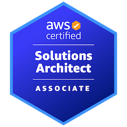

<blockquote class="twitter-tweet">
AWS SAA合格してた💪(&#39;ω&#39;💪) <a href="https://t.co/o7WPYTR7Di">pic.twitter.com/o7WPYTR7Di</a>
&mdash; くすはさん (@dj_kusuha) <a href="https://twitter.com/dj_kusuha/status/1700801999972012121?ref_src=twsrc%5Etfw">September 10, 2023</a></blockquote> 

というわけで、9月に受けていた AWS ソリューションアーキテクトアソシエイト(以下、SAA) ですが、無事に合格していました！

今回もザックリ勉強内容をまとめます。

## 受験のきっかけ

お仕事でちゃんと AWS に触れる事になったのがきっかけです。

これまでは Unity を中心としたクライアント側メインの業務が主だったんですが、サーバー側もやりたいなと思って志願して今年からサーバーチームにジョインさせてもらいました。

そこで AWS を利用していたので、 AWS を一通り勉強しようと思って調べてみたところ、 AWS 認定試験なるものを見つけ、いくつか種類はあるものの SAA が良さそうだな、と思って受験を決意。

また、 [Associateチャレンジ](https://pages.awscloud.com/traincert-JAPAN-field-GC-Associate-Certification-Challenge-2022-reg-event.html) という、受験料が半額になるキャンペーンもやっていた[^1]ので、それも受験モチベに繋がりました。

[^1]: 2023年9月で申し込み終了してしまいました…

## 利用した教材

[要点整理から攻略する　『AWS認定ソリューションアーキテクト-アソシエイト』 Kindle版](https://www.amazon.co.jp/dp/B0BSW3K3RM)

この本を買って一通り読み、巻末の練習問題を2週くらい解きました。

あとは [AWS Skill Builder](https://skillbuilder.aws/jp) で公式の模擬問題集が提供されていたので、それも解きました。

## 勉強期間

受験しようと思ったのが7月くらいで、受験したのが9月9日なので、**およそ2ヶ月**くらいでしょうか。1日あたりの勉強時間はだいたい**1時間くらい**だったと思います。なのでSAA受験のための**総学習時間は60時間前後**といったところ。

お仕事でも一部のAWSサービスについては日々触っていたので、それも合わせると**AWSに思いを馳せてたのは100時間くらいかも。**

ちなみに去年まではAWSほぼまともに触った事がなくて知見がかなり浅い状態だったので、既に下地がある人はもう少し学習時間短くても良さそうです。

## 受験してどうだったか

勉強してる時はまぁまぁ大変でした😇

「こんなサービス、ワイは今後使う機会なさそ〜」みたいなサービスも理解しないといけないし、モチベーションの維持がなかなか難しかったです。

一方で、割とよく使うであろう EC2, S3, RDS, CloudFront, VPC周り…といった部分で改めて知ったところも多々あり、今後の業務にも活かせそうな知識がある程度溜まったので、受験して良かったな〜と思います。

## SAP受けるの？

今は何も考えていませんｗ

今後もっとAWSを業務で使っていって理解が深まったら受験を考えるかも。

受験料も高いよね…一応合格者向けに半額のバウチャーをもらったので、SAA有効期限である3年以内に受けれたら良いなぁ。

## おわりに

AWS を使ったお仕事、した〜い！
